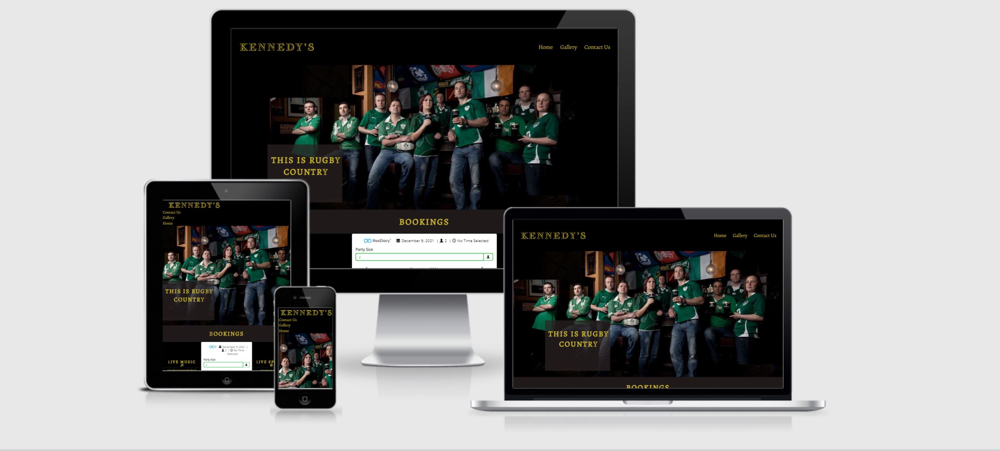
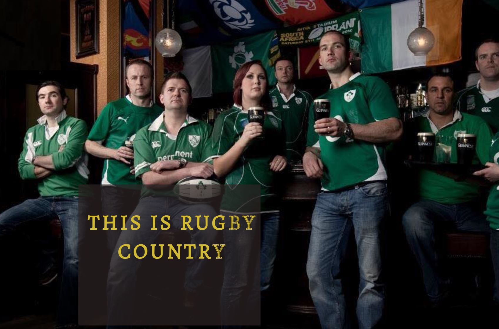
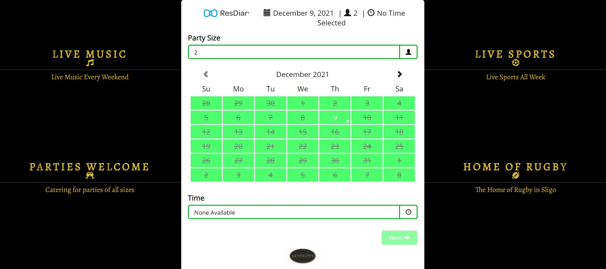

# Kennedy's Bar

Kennedy's Bar website is designed for T.J Kennedys Bar, Sligo. It is to provide information about the venue, contact details and the option of booking a table. 

Users of the site will be able to browse pictures of the venue in the Gallery section. They will also be able to submit a contact enquiry or make a booking through the Resdiary booking portal which is on the home page.

## Features

- Navigation
    - Links to home page, contact us and gallery. 
    - The navigation is in font similar to Kennedys. The color of the Kennedys logo is Gold. The background used is black to give good contrast.
    - The navigation is clear and simple. It displays the logo for Kennedys on the left and the 3 sections to the right (or under the logo in mobile view). 

- The Header

    - The header shows a photo of team at Kennedys with the slogan 'this is Rugby Country'. The pub has strong Rugby roots and is named after TJ Kennedy who played for Ireland in the 1970's.
    - The section provides a clear picture that this is a rugby pub.

- The Bookings Section

    - The booking section embed's the Resdiary booking portal. This gives the user instant access to reserving a table at Kennedys
    - Some of the features of the bar are highlighted on either side of the booking interface in desktop view. This is not displayed in mobile view.

