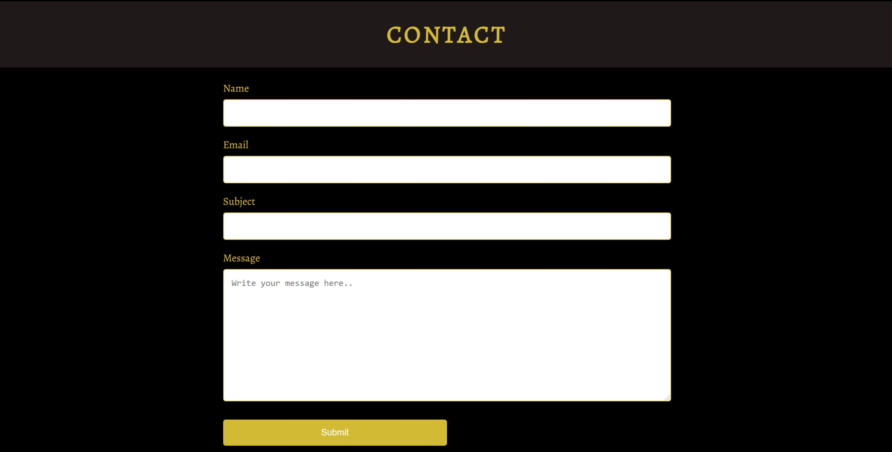
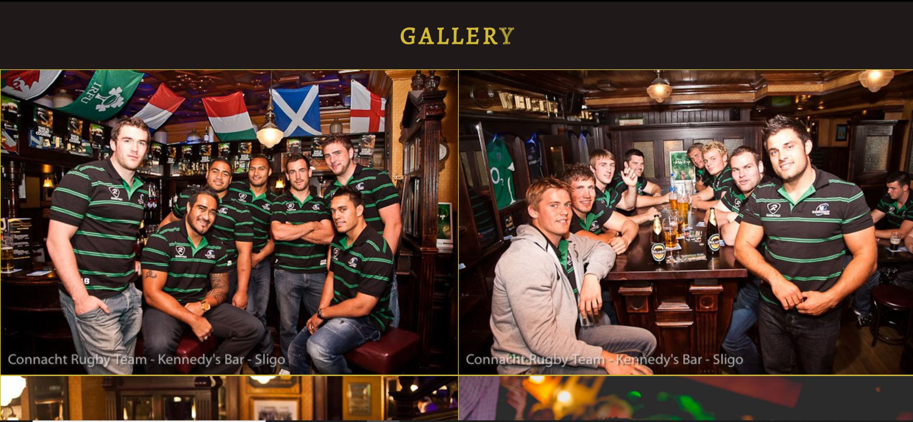
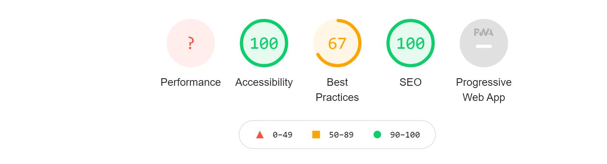

# Kennedy's Bar

Kennedy's Bar website is designed for T.J Kennedys Bar, Sligo. It is to provide information about the venue, contact details and the option of booking a table. 

Users of the site will be able to browse pictures of the venue in the Gallery section. They will also be able to submit a contact enquiry or make a booking through the Resdiary booking portal which is on the home page.

## Features

- Navigation
    - Links to home page, contact us and gallery. 
    - The navigation is in font similar to Kennedys. The color of the Kennedys logo is Gold. The background used is black to give good contrast.
    - The navigation is clear and simple. It displays the logo for Kennedys on the left and the 3 sections to the right (or under the logo in mobile view). 

- The Header

    - The header shows a photo of team at Kennedys with the slogan 'this is Rugby Country'. The pub has strong Rugby roots and is named after TJ Kennedy who played for Ireland in the 1970's.
    - The section provides a clear picture that this is a rugby pub.

- The Bookings Section

    - The booking section embed's the Resdiary booking portal. This gives the user instant access to reserving a table at Kennedys
    - Some of the features of the bar are highlighted on either side of the booking interface in desktop view. This is not displayed in mobile view.

- The Contact-Us Section

    - The contact section allows users to send a message to the bar and captures the necessary information like name, email and message.
    - It provides a quick and easy way of the user making contact

    

   - The Gallery Page

        - This provides the user with a selection of photos from Kennedys Bar. The images display a strong Rugby and live music theme.

         

## Testing

- I tested that the page works in the different browsers: Chrome, Safari, Firefox.
- I confirmed that this project is responsive, looks good and functions on all standard screen sizes using devtools device toolbar.
- I confirmed that the navigation, header, & contact-us text are all readable and easy to understand.
- I have confirmed that the form works. It requires entries at every field and it will only accept an email in the email field. The submit button works.

## Bugs

## Validator Testing

- HTML
    - No errors were found when passing through the official W3C validator
- CSS
    - No errors were found when passing through the offical Jigsaw validator
- Accessibility
    - Confirmed that font choice was easy to read and accessible by running it through lighthouse in devtools.

    

